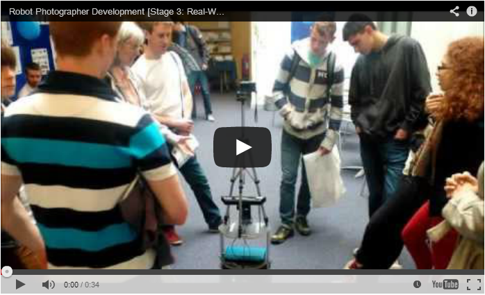
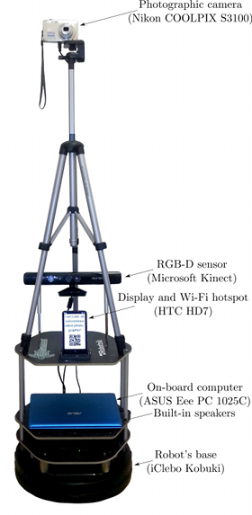
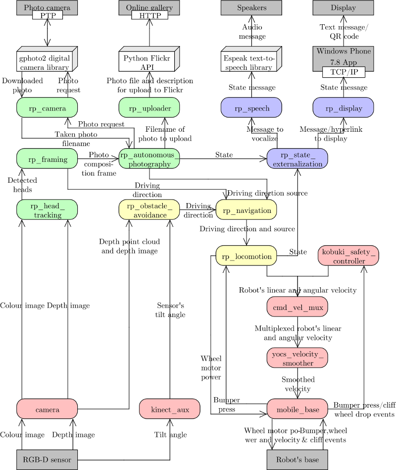
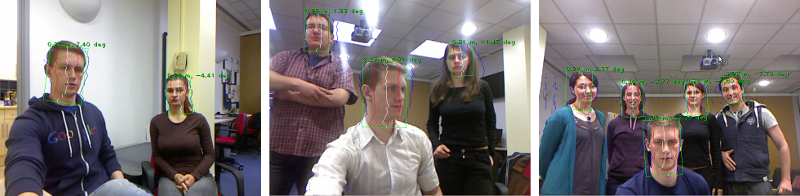
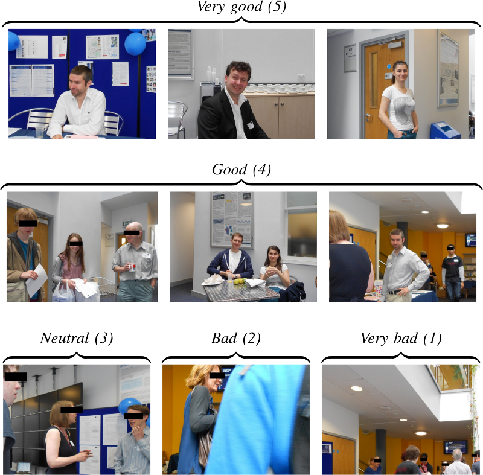

Luke: An Autonomous Robot Photographer
===

*An autonomous robot photographer should move around a crowd, avoiding collisions while taking reasonable pictures of the subjects within it. The system which fulfills this task (presented below) is based on a low-cost Turtlebot platform, the Kinect sensor, and a consumer-grade stills camera. The robot's control system was built using the ROS platform with the following subsumption layers: wander whilst avoiding collisions; subject tracking and photographing; and state externalisation, to inform the subjects about what the robot is doing. Novel software components include the crowd head detection, the photograph composition procedures, the subject-interface, and uploading the photographs to a social media website. The result is a system that shows good performance in a public environment, as evaluated by independent human judges.*

Introduction
---

Within the field of autonomous robotics (and the variety of its application areas), robot photographers serve as excellent low-cost research platforms. They encompass a number of challenges common in robotics research, like task and path planning, locomotion and navigation (including obstacle avoidance), and human subject detection/tracking.

Robot photographers also include multidisciplinary challenges, like the automatic photograph composition (which requires computational understanding of the aesthetics of photography) or Human-Robot Interaction (HRI). As pointed out by Byers et al. [9], robotic photographer platforms are particularly well suited for HRI research, since the general public can easily grasp the overall concept ("it's a robot whose job is to take pictures"), and thus tend to interact with the robot naturally.

Finally, robot photographers show potential in commercial applications (e.g. event photography), since the service costs of an autonomous robot photographer are significantly smaller than those of a professional photographer.

Below a system is described that uses a single Microsoft Kinect sensor for obstacle avoidance and people detection, coupled with a consumer "point-and-shoot" camera for taking the final images, and which outperforms earlier robot photographer approaches.

Robot Photographer's Hardware
---

The developed autonomous robot photographer, Luke (shown below), is built using iClebo Kobuki's base, which has a 4kg payload, an operating time of around 3 hours, and maximum velocity of 65cm/s. Furthermore, Kobuki's base contains three bumpers (left, center and right) which can be used to provide alternatives to vision-based obstacle avoidance. This base is integrated into the Turtlebot 2 open robotics platform.

For its vision, Luke uses a Microsoft Kinect RGB-D sensor, which provides both a 10-bit depth value and VGA resolution color at 30 FPS. The sensor has a combined 57° horizontal and 43° vertical field-of-view.
The Kinect was attached to the Turtlebot's base at an inclination of 10° in order to be able to track upright standing humans at a distance of 1.5-2m. Since this limits low obstacle detection abilities, the linear velocity of the robot is limited to 10cm/s and the bumpers on Kobuki's base are used to provide graceful recovery in the case of collision with a low-lying obstacle.

To take the photographic pictures Luke uses a simple point-and-shoot Nikon COOLPIX S3100 camera, which has a maximum resolution of 14 megapixels, a built-in flash, and supports automatic exposure/ISO sensitivity/white balance settings. This camera is mounted on a lightweight, aluminium König KN-TRIPOD21 tripod (weighing 645 grams), which is attached to the top mounting plate of the robot. The overall size of the robot is approximately 34cm x 135cm x 35cm (W x H x D).

For Luke's state externalization, an HTC HD7 smartphone with a 4.3 inch LCD display was mounted onto the robot. The display has a resolution of 480 x 800 pixels, and is used to display Luke's state messages and to show the QR (Quick Response) codes containing the URLs of the pictures that Luke takes and uploads to Flickr. The smartphone also serves as a wireless hotspot, providing a wireless network connection between Luke's on-board computer and a monitoring/debugging station. Furthermore, it provides the internet connection to the on-board computer (for photo uploading to Flickr) by tethering the phone's 3G/EDGE connection over Wi-Fi.

The on-board ASUS Eee PC 1025C netbook has an Intel Atom N2800 1.6 GHz CPU and 1 GB RAM, providing a battery life of around 3 hours and weighs just under 1.25kg. It is running the Groovy Galapagos version of the Robot Operating System framework (ROS, [29]) on a Ubuntu 12.04 LTS operating system. All processing (including obstacle avoidance, human subject detection, photographic composition evaluation and so on) is done on this machine.

The robot contains two major power sources: a 2200mAh lithium-ion battery which is enclosed in the Kobuki's base, and a 5200mAh lithium-ion battery installed in the on-board netbook. Table below summarizes how these sources are used to power individual hardware components of the robot.

Hardware component | Power source 
------------------ | -------------
On-board netbook   | Netbook's battery
Wheel motors   | Base's battery
Phone (display and Wi-Fi hotspot)  | Netbook's battery
Photographic camera    | Netbook's battery
Kinect RGB-D sensor   | Base and netbook's battery

During the empirical tests of the fully-powered robot, the average discharge times for the netbook's/Kobuki base's batteries were 3 hours and 6 minutes/3 hours and 20 minutes respectively.

Robot Photographer's Software
---

*Architectural Design*
---

Luke's software uses Brooks' [5] hierarchical levels-of-competence approach. Each of the layers in Luke's software hierarchy is based on the behaviors that Luke can perform:
  * The base layer allows Luke to aimlessly wander around the environment, while avoiding collisions.
  * The second layer suppresses the random wandering behavior at certain time intervals (adhering to what [5] called a *subsumption* architecture), and enables Luke to compose, take and upload photographs.
  * The final layer enables Luke to externalize his state *i)* visually, by showing text messages/QR codes on the attached display, and *ii)* vocally, by reading state messages out loud using text-to-speech software.

This architecture is illustrated in the following figure, and key implementation details are summarized below.

*Layer I: Random Walking with Collision Avoidance*
---

Luke's capability to randomly wander in the environment without bumping into any static or moving obstacles is implemented in three ROS nodes: *rp_obstacle_avoidance*, *rp_locomotion* and *rp_navigation*, as briefly described below.

Obstacle detection and avoidance is based on [3], chosen due to its computational efficiency and suitability for the random navigation mode which Luke uses to wander around in the environment. It consists of three main steps:
  1. The input point cloud is obtained using the GFreenect library [27], and subsampled using a voxel grid filter.
  2. The Kinect's tilt angle is provided by the Kinect AUX library [13] which returns the readings from the Kinect's accelerometer at 20Hz, and with a flat-floor assumption used to tweak the subsampled point cloud.
  3. The region of interest (ROI) in front of the robot (defined by the user) is isolated from the transformed point cloud and a moving average of the ROI's size calculated. A positive average size generates a turn direction, otherwise the robot moves forward.

To prevent the robot from getting stuck in an oscillating loop when facing a large obstacle, it is prohibited from changing the direction of the turn once it has started turning, as suggested in [3]. Also, an improvement from [28] is used whereby if the unfiltered point cloud is small then it is assumed that the robot is facing a nearby large obstacle, and a turn directive is issued.

*Layer II: Taking Well-Composed Photographs of Humans*
---

Luke's second major behavioral competence involves his ability to *i)* track humans in an unstructured environment, *ii)* take well-composed pictures of them, and *iii)* upload these pictures to an on-line picture gallery. This competence layer is implemented by five ROS nodes: *rp_head_tracking*, *rp_framing*, *rp_camera*, *rp_uploading* and *rp_autonomous_photography*.

The head detection and tracking node (*rp_head_tracking*) is the most sophisticated node in Luke's ROS graph. For subject head detection it uses a knowledge-based method by Garstka and Peters' [18], which is extended to cope with multiple people presence in the image. To improve the head detection results, it employs one of the two skin detectors: a Bayesian skin detector by Jones and Rehg [22], and an adaptive skin detector based on a logistic regression classifier with a Gaussian kernel, and trained on an on-line skin model obtained from the face regions detected using the Viola and Jones [32] detector. Finally, to exploit the spatial locality of human heads over a sequence of frames, this node uses a depth-based extension of the continuously-adaptive mean-shift algorithm by Bradski [4]. 

The multiple person extension still scans through a blurred and depth-shadow-filtered depth image one horizontal line at a time, from top to bottom. However, instead of keeping a single potential vertical head axis, a set of vertical head axes   is constructed. Each head axis is represented by , where  is the average candidate head distance from the sensor, and  are the image points on the vertical axis.
When a new arithmetic mean of left and right lateral gradients  is calculated in the original algorithm, the extended method searches for the head axis  such that the last added point  is within 5cm distance from the point .
If the pixel  satisfies the above constraint then  is updated by adding the point , and the average head distance  is recalculated.

A vertical head axis  is classified as a detected candidate head if it is closer than 5m, is between 20-30cm tall, and is rotated by less than 35°. A few examples of multiple head detection using this method are shown in figure below.

The detected candidate heads are verified using one out of two skin detection methods: a Bayesian classifier trained off-line on a very large scale skin/non-skin image dataset [22], and an on-line skin detector trained using skin histograms obtained from a small set of face detections using Viola and Jones [32] detector. In the first case a histogram-based Bayesian classifier similar to [22] is implemented and trained off-line on a large-scale Compaq skin dataset containing nearly a billion pixels, each hand-labelled as skin or non-skin.

If this skin classification method is used, then a given candidate head detection is accepted/rejected based on the proportion of skin-color pixels in the corresponding RGB image region.
In the second case, many faces are detected in the initialization stage using the frontal and profile face detectors using [32]. For each of the detected face rectangles, a binary mask is applied to segment the image into face oval/background regions, and the pixel hue histograms are assembled in each of the regions. Then these histograms are used as feature vectors in kernel logistic regression (KLR) classifier training. When this classifier is trained, the depth-based head detections can be verified by applying the same oval binary mask to the detected head rectangle, constructing a hue histogram from the face region, applying the KLR classifier, and thresholding.

To further reduce the computational complexity requirements of head/skin detection methods described above, a depth-data based extension of the continuously adaptive mean-shift tracking algorithm (CAMShift, [4]) is employed to exploit the spatial locality of humans over a sequence of frames. While the original CAMShift algorithm uses the probability distribution obtained from the color hue distribution in the image, in this project it is adapted to use the depth information. In particular, the constraints that [18] use to reject local horizontal minima which could not possibly lie on the vertical head axis, are used to define the following degenerate head probability:

which is then tracked using CAMShift.

The second most important node in Luke's "picture taking" behavioral capability layer is the photograph composition and framing (*rp_framing*) node. This node works as follows. First of all, it subscribes to the locations of detected/tracked human subject heads in Kinect's image plane, published by the *rp_head_tracking* node. Then this node maps the head locations from Kinect's image plane to the photographic camera's image plane and calculates the ideal framing based on the framing rules described by Dixon et al. [12]. If the calculated ideal frame lies outside the current photographic camera's image plane, a turn direction is proposed; otherwise, the ideal frame location is published over */rp/framing/frame* topic.

In order to map the locations of detected heads from Kinect's to photographic camera's image plane, the rigid body translation vector is first established between the Kinect senor and the photographic camera. Then, the photographic camera is undistorted using a "plumb bob" model proposed by [6]. This model simulates (and hence can be used to correct) both radial distortion caused by the spherical shape of the lens, and the tangential distortion, arising from the inaccuracies of the assembly process. Finally, the approach of [34], [35]  is used to estimate the camera intrinsics (viz. camera's focal length and principal point offsets). Then, any point in Kinect's world space can be projected into the photographic camera's image space.
Using this approach, the 3D locations of the detected heads (provided by the *rp_head_tracking* node) are projected onto the photographic camera's image plane. Then, based on these locations the ideal framing for the photographs is calculated using the photograph composition heuristics proposed by [12]. These heuristics are based on the following four photographic composition rules [21]:
  * *Rule of thirds*, which suggests that the points of interest in the scene should be placed at the intersections (or along) the lines which break the image into horizontal and vertical thirds.
  * *No middle* rule, which states that a single subject should not be placed at a vertical middle line of the photograph.
  * *No edge* rule, which states that the edges of an ideal frame should not be crossing through the human subjects.
  * *Occupancy* ("empty space") rule, which suggests that approximately a third of the image should be occupied by the subject of the photograph.

Given these rules, [12] define three different heuristics for single person and wide/narrow group picture composition. In order to choose which heuristic will be used they employ an iterative procedure. It starts by identifying a human subject closest to the center of the current image and calculating the ideal framing for this person using the single person composition heuristic. If this frame includes other candidate subjects, the group framing rules are applied iteratively on the expanded candidate set, until no new candidates are added.

After an ideal frame *F* is calculated, the *rp_framing* node calculates the overlap coefficient between the part of the frame visible in the current image and the whole frame.
If this exceeds a given threshold and the visible part of the frame exceeds the minimal width/height thresholds , the node considers that the satisfying composition has been achieved and publishes the position/size of the ideal frame over the */rp/framing/frame* topic. Otherwise, the framing node determines the direction of where the robot should turn in order to improve the quality of the composition (based on the position of the ideal frame's center w.r.t. the image's center) and publishes these driving directions over the */rp/framing/driving_direction* topic. In order to prevent the robot from getting stuck indefinitely while trying to achieve an ideal framing, a decaying temporal threshold for the minimum required overlap is also used. In the current robot photographer's implementation, the framing time limit is set to 60 seconds, the maximum deviation from the ideal overlap is set to 50% and the minimum visible frame size thresholds  are set to 2160 x 1620 pixels.

The *rp_autonomous_photography* node coordinates the actual photograph taking/uploading process, and divides the robot's control time between the obstacle avoidance (*rp_obstacle_avoidance*) and framing (*rp_framing*) nodes. The photograph taking node (*rp_camera*) acts as an interface between other ROS nodes and the physical Nikon COOLPIX S3100 camera that Luke uses to take pictures using the *libgphoto2* API for the open-source gPhoto² library [2], which in turn connects to the camera using the Picture Transfer Protocol (PTP). This node provides access to the camera for the rest of the Luke's ROS graph by exposing a ROS service at */rp/camera/photo*. Any other ROS node can send an empty request to this service, which *rp_camera* node transforms into the photo capture request for the *libgphoto2* API. This request triggers a physical camera capture, storing the taken picture in the camera's built-in memory. After the picture is taken, *rp_camera* node moves the picture from the camera's memory to the on-board computer and returns the string file name of the downloaded picture via the service response. The photograph uploading node (*rp_uploader*) uses the Python Flickr API [31] to upload image files to an online Flickr photo gallery. It exposes the Flickr API to the rest of ROS graph by providing */rp/uploader/upload* ROS service. The internet connection required for the picture uploading is provided by the on-board HTC HD7 phone (which also acts as a robot's state display) by tethering the phone's 3G/EDGE data connection over Wi-Fi to an on-board netbook which runs the overall Luke's ROS graph.

*Layer III: Externalization of the Current State via Vocal and Visual Messages*
---

Luke's third and final behavioral competence  involves its ability to externalize its current state via synthesized voice messages (played over the on-board computer's speakers), and text messages/QR codes (shown on the display of the attached HTC HD7 phone). The state externalization node (*rp_state_externalization*) subscribes to the status outputs from all major nodes in Luke's ROS graph, in particular, the lomotion (*rp_locomotion*), head tracking (*rp_head_tracking*), framing (*rp_framing*) and photography process control (*rp_autonomous_photography*) nodes.

In order to produce the robot's state messages (which are later vocalized/displayed by *rp_speech* and *rp_display* nodes) the state externalization node uses a table of pre-defined text messages, indexed by the states of four major nodes listed above. If the table contains more than one message for a given collection of states, then the message to be produced is chosen uniformly at random from the matching messages.
In the current implementation, a HTC HD7 phone is used to show the received messages. This phone has a 4.3 inch, 480 x 800 pixel LCD display, and is running Windows Phone (WP) 7.8 operating system. To show the messages generated by *rp_state_externalization* node, a WP OS app connects to the *rp_display* node over TCP and renders received text messages in full-screen mode. If a hyperlink is present within the received text message then this app also generates and renders a QR (Quick Response) code. This makes it easier for the humans in the robot's vicinity to follow this link, since any modern phone can use the phone's camera to automatically read QR codes.

To vocalize the text messages sent by *rp_externalization* node, the *rp_speech* node uses an open-source eSpeak [14] speech synthesis engine, which in turn is configured to use a formant synthesis based approach as described by Klatt [24].
Since this method does not need a database of speech samples and uses computationally cheap digital signal filters,  the resulting text-to-speech engine is both memory and CPU efficient, making it highly appropriate for the use in a mobile robot.

A few examples of pictures taken by this robot together with the average ratings assigned by independent judges are shown in the figure below.

References
---

[1] Hyunsang Ahn, Dohyung Kim, Jaeyeon Lee, Suyoung Chi, Kyekyung
Kim, Jinsul Kim, Minsoo Hahn, and Hyunseok Kim. A Robot
Photographer with User Interactivity. In Proceedings of the 2006
IEEE/RSJ International Conference on Intelligent Robots and Systems,
pages 5637–5643, 2006.

[2] Christophe Barbe, Hubert Figuiere, Hans Ulrich Niedermann, Marcus
Meissner, and Scott Fritzinger. gPhoto2: Digital Camera Software,
2002.

[3] Sol Boucher. Obstacle Detection and Avoidance using TurtleBot
Platform and XBox Kinect. Technical report, Rochester Institute of
Technology, 2012.

[4] Gary R Bradski. Computer Vision Face Tracking For Use in a
Perceptual User Interface. Intel Technology Journal, (Q2):214–219,
1998.

[5] R Brooks. A Robust Layered Control System for a Mobile Robot.
IEEE Journal of Robotics and Automation, 2(1):14–23, 1986.

[6] Duane C Brown. Decentering Distortion of Lenses. Photometric
Engineering, 32(3):444–462, 1966.

[7] M B Brown and A B Forsythe. The Small Sample Behavior of Some
Statistics Which Test the Equality of Several Means. Technometrics,
16(1):129–132, 1974.

[8] Morton B Brown and A B Forsythe. Robust Tests for Equality of
Variances. Journal of the American Statistical Association, 69:364–
367, 1974.

[9] Zachary Byers, Michael Dixon, Kevin Goodier, Cindy M Grimm, and
William D Smart. An Autonomous Robot Photographer. Intelligent
Robots and Systems, 3:2636–2641, 2003.

[10] J. Campbell and P. Pillai. Leveraging Limited Autonomous Mobility
to Frame Attractive Group Photos. In IEEE International Conference
on Robotics and Automation, pages 3396–3401, 2005.

[11] J Cohen. Weighted Kappa: Nominal Scale Agreement Provision
for Scaled Disagreement or Partial Credit. Psychological Bulletin,
70(4):213–220, 1968.

[12] Michael Dixon, C Grimm, and W Smart. Picture Composition for a
Robot Photographer. Technical report, Washington University in St.
Louis, 2003.

[13] Ivan Dryanovski, William Morris, St´ephane Magnenat, Radu Bogdan
Rusu, and Patrick Mihelich. Kinect AUX Driver for ROS, 2011.

[14] Jonathan Duddington. eSpeak: Speech Synthesizer, 2006.

[15] O. J. Dunn. Multiple Comparisons Among Means. Journal of the
American Statistical Association, 56(293):52–64, 1961.

[16] R A Fisher. On a Distribution Yielding the Error Functions of Several
Well-Known Statistics. In Proceedings of the International Congress
of Mathematicians, pages 805–813, 1924.

[17] Raghudeep Gadde and Kamalakar Karlapalem. Aesthetic Guideline
Driven Photography by Robots. In Proceedings of the Twenty-Second
International Joint Conference on Artificial Intelligence, volume 3,
pages 2060–2065, 2011.

[18] Jens Garstka and Gabriele Peters. View-dependent 3D Projection using
Depth-Image-based Head Tracking. In Proceedings of the 8th IEEE
International Workshop on Projector-Camera Systems, pages 52–58,
2011.

[19] W S Gosset. The Probable Error of the Mean. Biometrika, 6(1):1–25,
1908.

[20] David Gouaillier, Vincent Hugel, Pierre Blazevic, Chris Kilner, Jerome
Monceaux, Pascal Lafourcade, Brice Marnier, Julien Serre, and Bruno
Maisonnier. The NAO Humanoid: a Combination of Performance and
Affordability. In Computing Research Repository, pages 1–10, 2008.

[21] Tom Grill and Mark Scanlon. Photographic Composition. American
Photographic Book Publishing, Orlando, FL, 1990.

[22] Michael Jones and James M Rehg. Statistical Color Models with
Application to Skin Detection. International Journal of Computer
Vision, 46(1):81–96, 2002.

[23] Myung-Jin Kim, Tae-Hoon Song, Seung-Hun Jin, Soon-Mook Jung,
Gi-Hoon Go, Key-Ho Kwon, and Jae-Wook Jeon. Automatically
Available Photographer Robot for Controlling Composition and Taking
Pictures. In Proceedings of the 2010 IEEE/RSJ International Conference
on Intelligent Robots and Systems (IROS), pages 6010–6015,
2010.

[24] D H Klatt. Software for a Cascade/Parallel Formant Synthesizer.
Journal of the Acoustical Society of America, 67(3):971–995, 1980.

[25] William H Kruskal and AllenWWallis. Use of Ranks in One-Criterion
Variance Analysis. Journal of the American Statistical Association,
47(260):583–621, 1952.

[26] Henry B Mann and Donald R Whitney. On a Test of Whether One of
Two Random Variables is Stochastically Larger than the Other. Annals
of Mathematical Statistics, 18(1):50–60, 1947.

[27] OpenKinect. GFreenect Library, 2012.

[28] Brian Peasley and Stan Birchfield. Real-Time Obstacle Detection and
Avoidance in the Presence of Specular Surfaces using an Active 3D
Sensor. In 2013 IEEE Workshop on Robot Vision (WORV), pages
197–202, January 2013.

[29] Morgan Quigley, Brian Gerkey, Ken Conley, Josh Faust, Tully Foote,
Jeremy Leibs, Eric Berger, Rob Wheeler, and Andrew Ng. ROS: an
Open-Source Robot Operating System. In Proceedings of the 2009
IEEE International Conference on Robotics and Automation, 2009.

[30] Greg Shirakyan, Loke-Uei Tan, and Hilary Davy. Building Roborazzi,
a Kinect-Enabled Party Photographer Robot, 2012.

[31] Sybren A. Stuvel. Python Flickr API, 2007.

[32] Paul Viola and Michael Jones. Rapid Object Detection Using a
Boosted Cascade of Simple Features. In Proceedings of the 2001
IEEE Computer Society Conference on Computer Vision and Pattern
Recognition, pages 511–518, 2001.

[33] B L Welch. The Generalization of "Student's" Problem when Several
Different Population Variances are Involved. Biometrika, 34(1–2):28–
35, 1947.

[34] Zhengyou Zhang. Flexible Camera Calibration by Viewing a Plane
from Unknown Orientations. In Proceedings of the 7th IEEE International
Conference on Computer Vision, pages 666–673, 1999.

[35] Zhengyou Zhang. A Flexible New Technique for Camera Calibration.
IEEE Transactions on Pattern Analysis and Machine Intelligence,
22(11):1330–1334, 2000.
